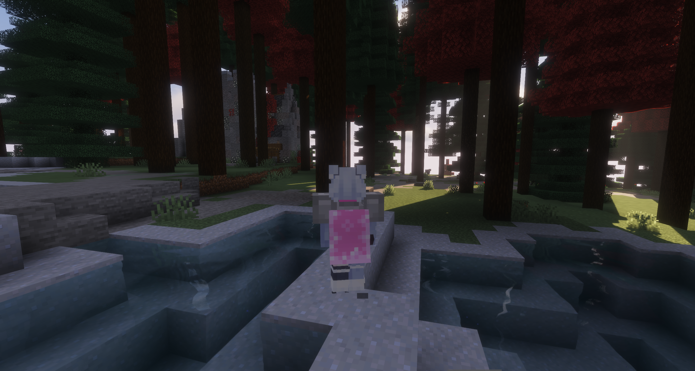
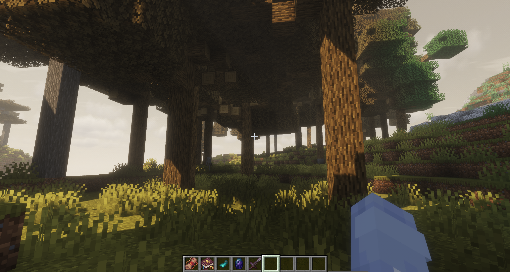
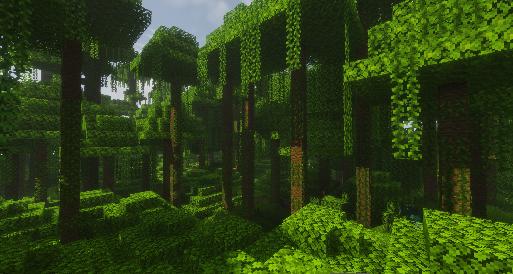
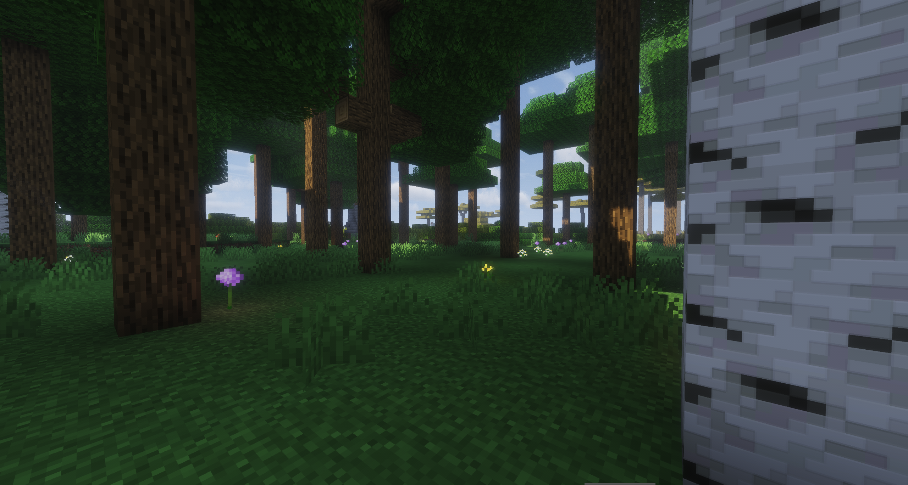
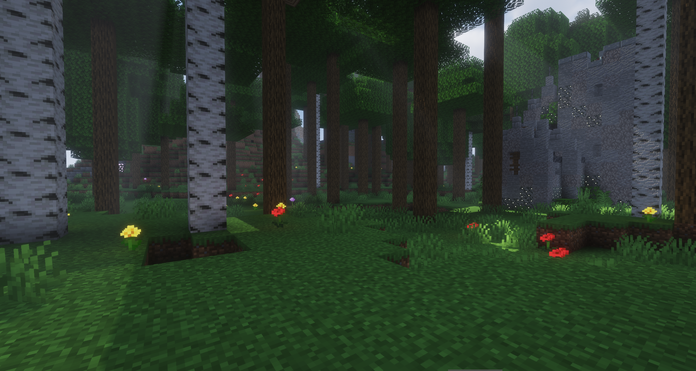

# ImmersiveForests

**ImmersiveForests** is a simple Minecraft mod that makes trees bigger, fuller, and more impressive — without changing any recipes or game mechanics.

## What It Does

By default, all naturally generated trees are significantly larger than vanilla:

- **Taller trunks** — tree trunks grow about 4× taller, making forests feel genuinely towering
- **Wider canopies** — foliage spreads roughly 2× further horizontally, creating dense, lush treetops
- **Fuller crowns** — leaf layers extend higher vertically as well, for a rounder, more natural silhouette
- **Extended leaf decay** — when a tree is cut down, leaves decay over a wider range to match the larger canopy size

All of these values are fully configurable in the config file, so you can dial the size up or down to your preference.

## Optional Features

- **Transparent Leaves** — a config toggle that makes leaves no longer block light, letting sunlight filter through the canopy to the forest floor

## Images

## Config

The config file immersiveforests.json is generated on first launch and lets you individually adjust:

| Option                      | Default | Description                      |
|-----------------------------|---------|----------------------------------|
| `TrunkBonus`                | 4.0     | Trunk height multiplier          |
| `FoliageHorizontalBonus`    | 2.0     | Canopy width multiplier          |
| `FoliageVerticalBonus`      | 2.0     | Canopy height multiplier         |
| `FoliageDecayRangeBonus`    | 2.0     | Leaf decay distance multiplier   |
| `LeavesNoLongerBlockLight`  | false   | Make leaves transparent to light |

## Note
The extension may cause unexpected behaviors with mods that make leaf decay faster. 

Accelerated Decay compatibility is already built-in. If you find issues with other mods, feel free to leave a note [here](https://github.com/MCTeamPotato/ImmersiveForests/issues).